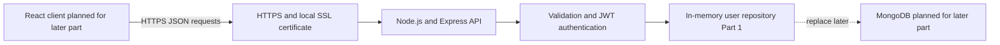

# HustleHub+ Part 1 Backend

HustleHub+ is a secure freelance marketplace platform. Freelancers will eventually advertise services and clients will browse and book those services. Part 1 establishes the secure backend foundation: user registration, login, JWT authentication, input validation, HTTPS, and controlled error handling (The Independent Institute of Education, 2026).

## Demonstration Video

[Click here to watch the demo video](https://youtu.be/DFl5a4ICBRY)

The video shows the API running over HTTPS, user registration, successful login, and JWT generation.

## Part 1 Scope

This repository implements the Node.js and Express backend required for Part 1. User records are stored in memory, which is permitted at this stage. The repository is isolated so it can be replaced by MongoDB in a later part without changing the authentication controllers or security middleware.

The protected profile and dashboard routes are authenticated examples. Marketplace browsing, gig management, bookings, transactions, financial calculations, and the React frontend belong to later stages and are not claimed as Part 1 functionality.

## Intended Users

The intended users are HustleHub+ clients and freelancers using the future React client application. Part 1 supports creating an account, signing in, and accessing information belonging to the authenticated user. Registration only accepts the `user` role so a user cannot assign themselves elevated privileges.

## Architecture

The overall system follows the MERN direction. Part 1 implements the secure backend boundary shown below; the React client and MongoDB persistence are planned components for later development.



The client and API are separated by an HTTPS system boundary. Public authentication endpoints issue tokens, while protected routes validate a bearer token on every request before accessing user data.

## Running the Backend

Requirements: Node.js 20 or later and OpenSSL. Open a terminal in the project root.

Install the dependencies:

```bash
npm install
```

Copy `.env.example` to `.env` and replace the example JWT secret with a strong private value. The supplied local certificate files are in `certs/`.

Start the HTTPS server:

```bash
npm run dev
```

The local API base URL is `https://localhost:3443`. The server refuses to start if the SSL key or certificate cannot be read and does not fall back to plain HTTP.

To regenerate the local certificate, run this from the project root:

```bash
openssl req -x509 -newkey rsa:2048 -sha256 -days 365 -nodes \
  -keyout certs/localhost-key.pem \
  -out certs/localhost-cert.pem \
  -subj "/C=ZA/ST=Western Cape/L=Cape Town/O=HustleHub+/OU=INSY7314/CN=localhost" \
  -addext "subjectAltName=DNS:localhost,IP:127.0.0.1"
```

The certificate is self-signed for local academic testing. In Postman, turn off SSL certificate verification when testing locally.

## API Endpoints

Public endpoints:

- `POST /api/auth/register` creates a user account.
- `POST /api/auth/login` authenticates a user and returns a JWT.

Protected endpoints require `Authorization: Bearer <token>`:

- `GET /api/auth/me` returns the authenticated user.
- `GET /api/profile` returns the authenticated user's profile.
- `PATCH /api/profile` updates the authenticated user's name.
- `GET /api/dashboard` returns a protected placeholder dashboard response.

## Backend Structure

The backend is organized under `src/`:

- `server.js` loads environment variables, loads the SSL certificate, and starts the HTTPS server.
- `app.js` configures Express, body parsing, routes, and error handling.
- `routes/auth.routes.js` maps registration, login, and current-user routes.
- `routes/profile.routes.js` maps protected profile routes.
- `routes/dashboard.routes.js` maps the protected dashboard route.
- `controllers/auth.controller.js` handles registration, login, and the current user.
- `controllers/profile.controller.js` reads and updates the authenticated profile.
- `controllers/dashboard.controller.js` returns the protected Part 1 dashboard placeholder.
- `middleware/validate-input.js` validates request bodies before controllers run.
- `middleware/authenticate.js` verifies bearer JWTs on protected requests.
- `middleware/error-handler.js` returns controlled 404 and 500 responses.
- `utils/validation.js` contains input and JWT claim validation rules.
- `utils/password.js` hashes and verifies passwords with bcrypt.
- `utils/token.js` signs and verifies HS256 JWTs.
- `repositories/user.repository.js` stores users in memory and removes password hashes from public responses.

## Security Decisions

### Password hashing

Passwords are never stored or returned in plain text. Registration hashes each password with bcrypt using 12 salt rounds. Adaptive password hashing is preferred to reversible encryption or plain-text storage (OWASP Foundation, n.d.-c). Login compares the submitted password against the stored hash, and the public-user mapping removes `passwordHash` before a response is returned.

### JWT authentication

Successful login issues a short-lived HS256 JWT containing only the user ID, email, and role. The signing secret is read from `JWT_SECRET`, and the application fails fast if it is missing. JWT payloads are treated as readable by token holders, so passwords and password hashes are never included (npm, n.d.-b).

Every protected request passes through the authentication middleware. It checks the bearer header, verifies the signature and expiry, restricts verification to HS256, validates the claims, and confirms that the user still exists. Invalid or expired credentials receive a generic `401` response.

### Input validation

Registration and login input is validated before controller processing. Validation is applied at the boundary so malformed or unexpected data is rejected before it enters the workflow (OWASP Foundation, n.d.-a). The API requires JSON objects, rejects unexpected fields, normalizes email addresses, validates email formats, restricts names to safe characters and bounded lengths, and requires passwords to contain letters and numbers without whitespace. Only the `user` role is accepted. Request bodies are limited to 10 KB.

### HTTPS

The server uses `https.createServer` with a locally configured SSL key and certificate. There is no plain HTTP listener. HTTPS encrypts passwords during registration and login and protects JWTs sent in subsequent requests (Express.js, n.d.-a; Node.js, n.d.). The certificate is self-signed and intended only for local testing.

### Controlled errors

Unknown routes return JSON `404` responses. Malformed or oversized request bodies are handled centrally. Unexpected server errors return a generic message and an error ID rather than stack traces, file paths, configuration values, or other internal details. Avoiding technical error disclosure limits reconnaissance information available to an attacker (Express.js, n.d.-b; OWASP Foundation, n.d.-b). Detailed errors are logged server-side only.

## Postman Testing

The Postman collection is located at `postman/HustleHub-API.postman_collection.json`.

In Postman, disable SSL certificate verification for the local self-signed certificate. Run successful registration first, then successful login and copy its `accessToken` into the collection variable named `token`. Use that token for the protected requests.

The collection demonstrates successful registration and login, authenticated access, protected access without a token, invalid input, duplicate registration, incorrect login credentials, invalid tokens, profile updates, and controlled error responses.

## Part 1 Submission Checklist

- MERN-oriented architecture diagram showing system boundaries and security controls.
- Node.js and Express backend API.
- User registration and login functionality.
- Bcrypt password hashing with no plain-text password storage.
- JWT issuance at login and validation on every protected request.
- HTTPS using the local SSL certificate.
- Input validation and controlled error responses.
- README explaining the system, intended users, backend structure, and security decisions.
- Postman collection and API response screenshots.
- Demonstration video showing the API running, user registration, successful login, and JWT generation.

## Limitations For Part 1

User data is intentionally stored in memory and is lost when the server stops. A database, React frontend, role-based access control for multiple user types, gig management, booking workflows, transaction records, tax calculations, rate limiting, security headers, automated pipelines, and monitoring are reserved for later POE parts.

## References

Auth0. n.d. JSON Web Token libraries. [Online]. Available at: https://auth0.com/blog/critical-vulnerabilities-in-json-web-token-libraries/ [Accessed 4 September 2026].

Detlefsen, A. and Manico, J. 2015. *Iron-Clad Java: Building Secure Web Applications*. New York: McGraw-Hill Education.

Express.js. n.d.-b. Error handling. [Online]. Available at: https://expressjs.com/en/guide/error-handling.html [Accessed 4 September 2026].

Express.js. n.d.-a. Production best practices: security. [Online]. Available at: https://expressjs.com/en/advanced/best-practice-security/ [Accessed 4 September 2026].

Node.js. n.d. HTTPS. [Online]. Available at: https://nodejs.org/api/https.html [Accessed 4 September 2026].

npm. n.d.-a. bcrypt. [Online]. Available at: https://www.npmjs.com/package/bcrypt [Accessed 4 September 2026].

npm. n.d.-b. jsonwebtoken. [Online]. Available at: https://www.npmjs.com/package/jsonwebtoken [Accessed 4 September 2026].

OWASP Foundation. n.d.-a. Input Validation Cheat Sheet. [Online]. Available at: https://cheatsheetseries.owasp.org/cheatsheets/Input_Validation_Cheat_Sheet.html [Accessed 4 September 2026].

OWASP Foundation. n.d.-b. Error Handling Cheat Sheet. [Online]. Available at: https://cheatsheetseries.owasp.org/cheatsheets/Error_Handling_Cheat_Sheet.html [Accessed 4 September 2026].

OWASP Foundation. n.d.-c. Password Storage Cheat Sheet. [Online]. Available at: https://cheatsheetseries.owasp.org/cheatsheets/Password_Storage_Cheat_Sheet.html [Accessed 4 September 2026].

The Independent Institute of Education. 2024. *Harvard Style Reference Guide: Adapted for The IIE*. [PDF].

The Independent Institute of Education. 2026. *INSY7314 Module Manual*. [Module manual].
